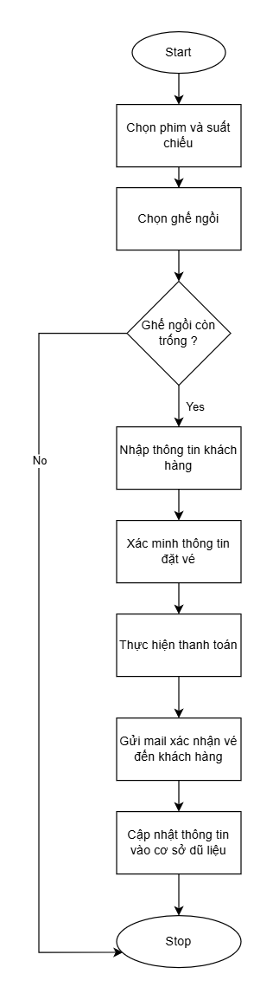
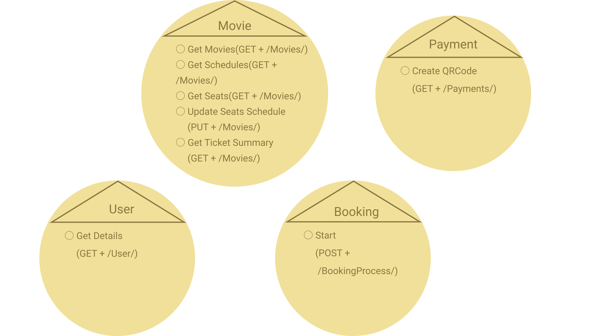
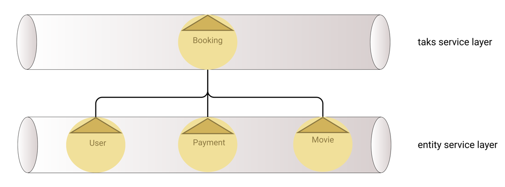
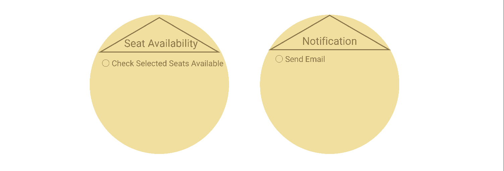
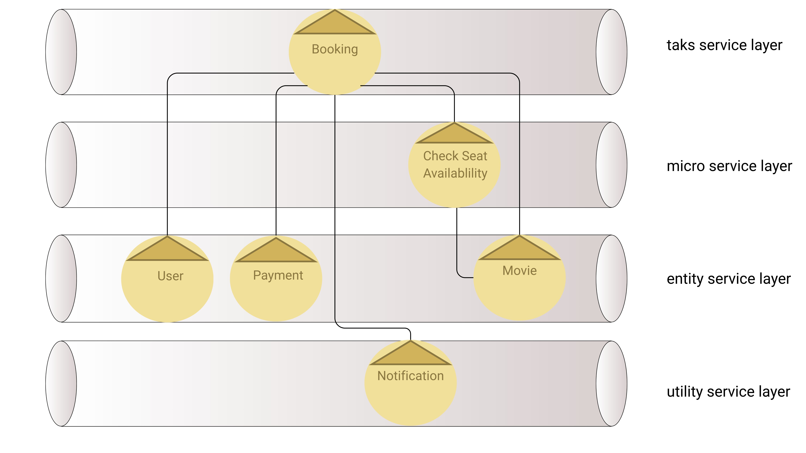
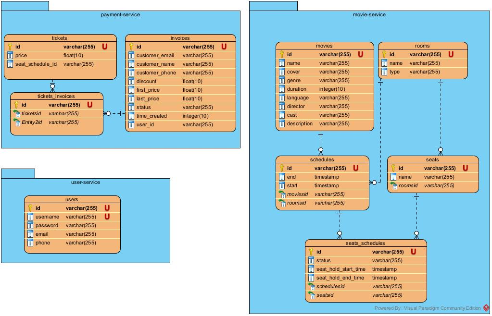

# 📊 Module Đặt vé xem phim - Phân tích và Thiết kế

## 1. 🎯Vấn đề cần giải quyết

### Mô tả chung
Hệ thống đặt vé xem phim cho phép khách hàng chọn phim, suất chiếu, ghế ngồi
và tiến hành đặt vé trực tuyến. Sau khi khách hàng chọn phim, hệ thống sẽ kiểm tra tình
trạng chỗ ngồi, xác minh thông tin vé, và xử lý thanh toán. Nếu đặt vé thành công, hệ
thống sẽ gửi thông báo xác nhận vé đã đặt đến email của khách hàng.

### Mô tả chi tiết
1. Bắt đầu quy trình đặt vé: Khách hàng truy cập hệ thống và bắt đầu quy trình đặt
vé xem phim.
2. Chọn phim và suất chiếu: Khách hàng chọn phim muốn xem, cùng với suất
   chiếu cụ thể.
3. Chọn ghế ngồi: Khách hàng chọn ghế ngồi từ danh sách các ghế trong lịch chiếu tương ứng.
4. Xác minh ghế ngồi còn trống: Hệ thống kiểm tra tình trạng ghế ngồi đã được
   chọn xem còn trống hay đã có người đặt.
5. Nếu không còn ghế ngồi, kết thúc quy trình: Nếu ghế đã được đặt bởi người
   khác, hệ thống thông báo và dừng quy trình.
6. Nhập thông tin khách hàng: Khách hàng cung cấp các thông tin cá nhân như họ
   tên, số điện thoại và email.
7. Xác minh thông tin vé: Hệ thống xác minh thông tin vé xem phim và các chi tiết
   liên quan.
8. Thực hiện thanh toán: Khách hàng tiến hành thanh toán trực tuyến
   thông qua các cổng thanh toán.
9. Nếu thanh toán thành công, gửi thông báo xác nhận: Nếu giao dịch thành công,
   hệ thống gửi thông báo xác nhận vé đã đặt đến email của khách hàng.
10. Cập nhật tình trạng ghế ngồi: Hệ thống cập nhật tình trạng ghế đã được đặt vào
    cơ sở dữ liệu.
11. Lưu thông tin vé và khách hàng vào cơ sở dữ liệu: Hệ thống lưu thông tin vé đã
    đặt và thông tin khách hàng vào cơ sở dữ liệu để quản lý.

<!-- 

  
   
  Luồng xử lí của module

 -->

---

## 2. 🧩 Phân tích, thiết kế các module dịch vụ

### Bước 1: Phân tách quy trình nghiệp vụ

| Bước | Hành động                                            |
|------|------------------------------------------------------|
| 1    | Bắt đầu quy trình                                    |
| 2    | Tải thông tin phim                                   |
| 3    | Khách hàng chọn phim                                 |
| 4    | Tải thông tin lịch chiếu ứng với phim được chọn      |
| 5    | Khách hàng chọn lịch chiếu                           |
| 6    | Tải thông tin ghế tương ứng với lịch chiếu được chọn |
| 7    | Khách hàng chọn ghế                                  |
| 8    | Xác minh ghế còn trống                               |
| 9    | Nếu tồn tại ghế không trống thì dừng quy trình       |
| 10   | Khách hàng nhập thông tin cá nhân                    |
| 11   | Xác minh thông tin vé                                |
| 12   | Khách hàng chọn thanh toán                           |
| 13   | Cập nhật tình trạng ghế sang đã giữ                  |
| 14   | Tạo mã QR thanh toán                                 |
| 15   | Khách hàng thực hiện thanh toán                      |
| 16   | Theo dõi tiến trình thanh toán                       |
| 17   | Nếu thanh toán thất bại thì dừng quy trình           |
| 18   | Gửi email thông báo đặt vé thành công                |
| 19   | Cập nhật tình trạng ghế sang đã đặt                  |
| 20   | Lưu thông tin vé và khách hàng                       |

### Bước 2: Loại bỏ các hành động không phù hợp

| Bước | Hành động                                            |
|------|------------------------------------------------------|
| 1    | Bắt đầu quy trình                                    |
| 2    | Tải thông tin phim                                   |
| 3    | ~~Khách hàng chọn phim~~                             |
| 4    | Tải thông tin lịch chiếu ứng với phim được chọn      |
| 5    | ~~Khách hàng chọn lịch chiếu~~                       |
| 6    | Tải thông tin ghế tương ứng với lịch chiếu được chọn |
| 7    | ~~Khách hàng chọn ghế~~                              |
| 8    | Xác minh ghế còn trống                               |
| 9    | Nếu tồn tại ghế không trống thì dừng quy trình       |
| 10   | ~~Khách hàng nhập thông tin cá nhân~~                |
| 11   | Xác minh thông tin vé                                |
| 12   | ~~Khách hàng chọn thanh toán~~                       |
| 13   | Cập nhật tình trạng ghế sang đã giữ                  |
| 14   | Tạo mã QR thanh toán                                 |
| 15   | ~~Khách hàng thực hiện thanh toán~~                  |
| 16   | Theo dõi tiến trình thanh toán                       |
| 17   | Nếu thanh toán thất bại thì dừng quy trình           |
| 18   | Gửi email thông báo đặt vé thành công                |
| 19   | Cập nhật tình trạng ghế sang đã đặt                  |
| 20   | Lưu thông tin vé và khách hàng                       |

### Bước 3: Phân loại hành động theo khả năng tái sử dụng

Phân loại các hành động thành 2 loại: khả tri (in đậm) và bất khả tri.

| Bước | Hành động                                            |
|------|------------------------------------------------------|
| 1    | **Bắt đầu quy trình**                                |
| 2    | Tải thông tin phim                                   |
| 3    | Tải thông tin lịch chiếu ứng với phim được chọn      |
| 4    | Tải thông tin ghế tương ứng với lịch chiếu được chọn |
| 5    | **Xác minh ghế còn trống**                           |
| 6    | **Nếu tồn tại ghế không trống thì dừng quy trình**   |
| 7    | Xác minh thông tin vé                                |
| 8    | Cập nhật tình trạng ghế sang đã giữ                  |
| 9    | Tạo mã QR thanh toán                                 |
| 10   | **Theo dõi tiến trình thanh toán**                   |
| 11   | **Nếu thanh toán thất bại thì dừng quy trình**       |
| 12   | Cập nhật tình trạng ghế sang đã đặt                  |
| 13   | Lưu thông tin vé và khách hàng                       |
| 14   | Gửi email thông báo đặt vé thành công                |

Sau khi phân loại, chuyển các hành động bất khả tri thành các ứng viên 
dịch vụ thực thế (Entity Service), gồm:

* User Service với các năng lực: Lấy thông tin phim, lịch chiếu, ghế, cập nhật trạng thái ghế và lấy thông tin tóm tắt của vé (các thông tin liên quan đến 3 thành phần trên).
* Movie Service với các năng lực: Tạo vé, hóa đơn, tạo mã QR code và thông báo trạng thái thanh toán.
* Payment Service với năng lực: Lấy thông tin người dùng.

  
   
  Các ứng viên dịch vụ thực thể 

### Bước 4: Nhận diện Process-Specific Logic

Các logic điều phối bao gồm: 
* Bắt đầu quy trình
* Xác minh ghế còn trống
* Kiểm tra ghế trống
* Theo dõi thanh toán
* Kiểm tra trạng thái thanh toán
* Dừng quy trình

Các logic này sẽ được gom chung vào ứng viên dịch vụ điều phối quy trình 
đặt vé là Booking Service.

  
   
  Ứng viên dịch vụ điều phối

### Bước 5: Lựa chọn các tài nguyên

Các tài nguyên được sử dụng trong toàn bộ quy trình xử lí bao gồm:
* `/users/`
* `/movies/`
* `/payments/`
* `/seat-availability/`
* `/notification/`
* `/bookings/`
* `/auth/`

> Lưu ý: Tài nguyên ứng với route /auth/ sẽ được sử dụng cho mục đích xác thực người dùng.

Ánh xạ các tài nguyên tương ứng với các dịch vụ thực thể.

| Dịch vụ          | Tài nguyên   |
|------------------|--------------|
| User Service     | `/users/`    |
| Movie Service    | `/movies/`   |
| Payment Service  | `/payments/` |

### Bước 6: Liên kết các tài nguyên với năng lực dịch vụ và phương thức

  
   
  Các ứng viên dịch vụ thực thể cùng năng lực xử lí

### Bước 7: Áp dụng các quy tắc thiết kế hướng dịch vụ

Các nguyên tắc thiết kế hướng dịch vụ được áp dụng ở đây bao gồm: 

* Tránh phụ thuộc giữa các Entity Service.
* Chỉ triển khai logic điều phối ở Task Service.

### Bước 8: Xác định ứng viên tổ hợp dịch vụ

Trong quá trình triển khai logic nghiệp vụ của module, Booking Service sẽ cần tương tác với các dịch vụ thực thể là User Service, Movie Service, Payment Service để trao đổi các thông tin sau.

| Service đích     | Nội dung                        | Định dạng |
|------------------|---------------------------------|-----------|
| User Service     | Thông tin người dùng            | JSON      |
| Movie Service    | Thông tin phim, lịch chiếu, ghế | JSON      |
| Payment Service  | Thông tin thanh toán            | JSON      |

  
   
  Tổ hợp các ứng viên dịch vụ của module

### Bước 9: Phân tích yêu cầu xử lý

Trong các logic điều phối được đề cập bên trên, logic `kiểm tra trạng thái ghế còn trống` là logic có thể thay đổi theo quy tắc kinh doanh (VD: giữ chỗ tạm, chặn ghế kĩ thuật và phân quyền ghế ) nên sẽ được phân tách ra thành một Micro Service, hay một phiên bản nhỏ của Task Service.

Ngoài ra, `gửi thông báo cho người dùng` cũng là một logic có thể tải sử  dụng được ở nhiều module khác (VD: xác thực thông tin người dùng, nhắc lịch xem phim, thông báo thay đổi suất chiếu) nhưng lại không liên quan trực tiếp đến quy trình kinh doanh nên sẽ được tách thành một dịch vụ tiện ích.

Như vậy, các nguồn tài nguyên cho các dịch vụ điều phối và tiện ích sẽ được phân phối như sau.

| Dịch vụ                   | Tài nguyên             |
|---------------------------|------------------------|
| Booking Service           | `/booking/`            |
| Seat Availability Service | `/seat-availability/`  |
| Notification Service      | `/notification/`       |

Các năng lực tương ứng của 2 dịch vụ này sẽ là:
 * Seat Availability Service: Kiểm tra trạng thái trống của ghế
 * Notification Service: Gửi email thông báo thanh toán thành công đến người dùng

  
   
  Các ứng viên dịch vụ micro và tiện ích

### Bước 10: Xác định phương thức ứng với các năng lực của dịch vụ dạng micro

  
   
  Ứng viên dịch vụ micro và năng lực xử lí

### Bước 11: Xác định phương thức ứng với các năng lực của dịch vụ tiện ích

  
   
  Ứng viên dịch vụ tiện ích và năng lực xử lí

### Bước 12: Áp dụng lại nguyên tắc thiết kế hướng dịch vụ

Áp dụng 2 nguyên tắc thiết kế hướng dịch vụ đã trình bày bên trên và nội dung phân tích xử lí ở bước 9, tổ hợp dịch vụ được sử dụng cho module đặt vé sẽ được thay đổi như hình dưới đây.

  
   
  Tổ hợp các ứng viên dịch vụ của module sau khi phân tách lại

### KẾT QUẢ PHÂN LOẠI DỊCH VỤ

| Dịch vụ                   | Trách nhiệm                                                                                                                                                    | Công nghệ  |
|---------------------------|----------------------------------------------------------------------------------------------------------------------------------------------------------------|------------|
| Gateway                   | Điều hướng yêu cầu đến các service khác                                                                                                                        | Springboot |
| Auth Service              | Xác minh thông tin đăng nhập của người dùng                                                                                                                    | Springboot |
| User Service              | Quản lí thông tin người dùng                                                                                                                                   | Springboot |
| Movie Service             | Quản lí thông tin phim, phòng, lịch chiếu, ghế                                                                                                                 | Springboot |
| Payment Service           | Quản lí thông tin vé, hóa đơn; tạo mã QR và thông báo trạng thái thanh toán                                                                                    | Springboot |
| Seat Availability Service | Kiểm tra trạng thái sẵn sàng của ghế                                                                                                                           | Springboot |
| Notification Service      | Gửi thông báo đặt vé thành công đến người dùng                                                                                                                 | Springboot |
| Booking Service           | Xử lí toàn bộ quy trình từ lấy các thông tin phim, lịch chiếu, ghế; xác minh trạng thái ghế, xác minh thông tin vé; thanh toán và gửi thông báo đến người dùng | Springboot |
| Registry Service          | Cầu nối giữa các dịch vụ với nhau                                                                                                                              | Springboot |

> Lưu ý: Gateway, Auth Service, Registry Service là các thành phần cố định của hệ thống (không phụ thuộc vào yêu cầu cụ thể của module).

---

## 3. 🔄 Giao tiếp giữa các dịch vụ

### Phương thức giao tiếp

Các service trong hệ thống giao tiếp và phối hợp với nhau thông qua **REST APIs** và **Kafka Message Broker** 
giúp tăng tính linh hoạt, khả năng mở rộng và đảm bảo hiệu suất của toàn bộ hệ thống khi phải xử lý lượng lớn 
dữ liệu hoặc người dùng đồng thời.

### Các luồng giao tiếp chính

* Gateway ⇄ Booking Service (REST)
  * Gateway làm nhiệm vụ định tuyến các yêu cầu đến Booking Service.
* Booking Service ⇄ Movie Service (REST, Kafka)
  * Booking Service gọi Movie Service để thực hiện các xử lí liên quan đến lấy các thông tin phim, lịch chiếu, ghế đồng bộ và cập nhật trạng thái ghế theo kiểu bất đồng bộ.
* Booking Service ⇄ Payment Service (REST, Kafka)
  * Booking Service gọi Payment Service để thực hiện tạo mã QR thanh toán.
  * Payment Service gọi Booking Service theo kiểu bất đồng bộ để trả về trạng thái của các thanh toán.
* Booking Service ⇄ Seat Available Service (REST)
  * Booking Service gọi Seat Available Service để kiểm tra trạng thái ghế còn trống.
* Booking Service ⇄ Notification Service (Kafka)
  * Booking Service gọi Notification Service theo kiểu bất đồng bộ để gửi email thông báo đặt vé thành công đến người dùng.
* Seat Available Service ⇄ Movie Service (REST)
  * Seat Available Service gọi Movie Service để lấy trạng thái của các ghế.

---

## 4. 🗂️ Thiết kế cơ sở dữ liệu

## 4.1. User Service Database

### Bảng: users
| Column   | Data Type    | Description                    |
|----------|--------------|--------------------------------|
| id       | VARCHAR(255) | ID người dùng (Primary Key)   |
| username | VARCHAR(255) | Tên đăng nhập (Unique)         |
| password | VARCHAR(255) | Mật khẩu                       |
| email    | VARCHAR(255) | Email người dùng               |
| phone    | VARCHAR(255) | Số điện thoại                  |

---

## 4.2. Movie Service Database

### Bảng: movies
| Column      | Data Type    | Description                |
|-------------|--------------|----------------------------|
| id          | VARCHAR(255) | ID phim (Primary Key)      |
| name        | VARCHAR(255) | Tên phim                   |
| cover       | VARCHAR(255) | Ảnh bìa phim               |
| genre       | VARCHAR(255) | Thể loại phim              |
| duration    | INTEGER(10)  | Thời lượng phim (phút)     |
| language    | VARCHAR(255) | Ngôn ngữ phim              |
| director    | VARCHAR(255) | Đạo diễn                   |
| cast        | VARCHAR(255) | Diễn viên                  |
| description | VARCHAR(255) | Mô tả phim                 |

### Bảng: rooms
| Column | Data Type    | Description              |
|--------|--------------|--------------------------|
| id     | VARCHAR(255) | ID phòng (Primary Key)   |
| name   | VARCHAR(255) | Tên phòng                |
| type   | VARCHAR(255) | Loại phòng               |

### Bảng: schedules
| Column    | Data Type    | Description                             |
|-----------|--------------|----------------------------------------|
| id        | VARCHAR(255) | ID lịch chiếu (Primary Key)             |
| start     | TIMESTAMP    | Thời gian bắt đầu chiếu                 |
| end       | TIMESTAMP    | Thời gian kết thúc chiếu                |
| moviesid  | VARCHAR(255) | ID phim (Foreign Key tới bảng movies)   |
| roomsid   | VARCHAR(255) | ID phòng (Foreign Key tới bảng rooms)   |

### Bảng: seats
| Column  | Data Type    | Description                           |
|---------|--------------|---------------------------------------|
| id      | VARCHAR(255) | ID ghế (Primary Key)                  |
| name    | VARCHAR(255) | Tên/Số ghế                            |
| roomsid | VARCHAR(255) | ID phòng (Foreign Key tới bảng rooms) |

### Bảng: seats_schedules
| Column                | Data Type    | Description                                |
|-----------------------|--------------|--------------------------------------------|
| id                    | VARCHAR(255) | ID (Primary Key)                           |
| status                | VARCHAR(255) | Trạng thái ghế (trống/đã đặt/đang giữ)     |
| seat_hold_start_time  | TIMESTAMP    | Thời gian bắt đầu giữ ghế                 |
| seat_hold_end_time    | TIMESTAMP    | Thời gian kết thúc giữ ghế                |
| schedulesid           | VARCHAR(255) | ID lịch chiếu (Foreign Key tới schedules)  |
| seatsid               | VARCHAR(255) | ID ghế (Foreign Key tới bảng seats)       |

---

## 4.3. Payment Service Database

### Bảng: tickets
| Column           | Data Type    | Description                                       |
|------------------|--------------|---------------------------------------------------|
| id               | VARCHAR(255) | ID vé (Primary Key)                               |
| price            | FLOAT(10)    | Giá vé                                            |
| seat_schedule_id | VARCHAR(255) | ID ghế-lịch chiếu       |

### Bảng: invoices
| Column         | Data Type    | Description                           |
|----------------|--------------|---------------------------------------|
| id             | VARCHAR(255) | ID hóa đơn (Primary Key)              |
| customer_email | VARCHAR(255) | Email khách hàng                      |
| customer_name  | VARCHAR(255) | Tên khách hàng                        |
| customer_phone | VARCHAR(255) | Số điện thoại khách hàng              |
| discount       | FLOAT(10)    | Số tiền giảm giá                      |
| first_price    | FLOAT(10)    | Giá gốc                               |
| last_price     | FLOAT(10)    | Giá cuối cùng (sau giảm giá)          |
| status         | VARCHAR(255) | Trạng thái hóa đơn                    |
| time_created   | INTEGER(10)  | Thời gian tạo hóa đơn (timestamp)     |
| user_id        | VARCHAR(255) | ID người dùng     |

### Bảng: tickets_invoices
| Column    | Data Type    | Description                             |
|-----------|--------------|----------------------------------------|
| id        | VARCHAR(255) | ID (Primary Key)                        |
| ticketsid | VARCHAR(255) | ID vé (Foreign Key tới bảng tickets)    |
| EntityId  | VARCHAR(255) | ID hóa đơn (Foreign Key tới invoices)   |

  
   
  Cơ sở dữ liệu

---

## 5. 🔐 Bảo mật trong hệ thống

Hệ thống chỉ có thể truy cập thông qua Gateway và sử dụng cơ chế của JWT để quản lí các phiên người dùng.
* JWT token được mã hóa bởi thuật toán mã khóa khóa đối xứng
  * Token được phát hành ở Auth Service sử dụng khóa bí mật.
  * Token được xác minh tại Gateway và các Service còn lại (trừ Registry Service) bằng khóa công khai.
* Quá trình xác thực token sẽ được thực thi trong các trường hợp
  * Có yêu cầu bên ngoài gọi đến Gateway.
  * Có lời gọi nội bộ giữa các Service.

---

## 6. 📦 Kế hoạch triển khai

* Sử dụng `docker-compose` để quản lí môi trường local.
* Mỗi Service đều có Dockerfile riêng với cấu hình môi trường được lưu trong file `application.yaml`.

---

## 7. 🎨 Sơ đồ kiến trúc

  
   
  Sơ đồ kiến trúc

---

## ✅ Summary

Với bài toán đặt vé xem phim, việc triển khai một hệ thống dạng microservice như trên sẽ giúp đáp ứng 
các yêu cầu về hiệu năng, khả năng mở rộng và dễ dàng bảo trì, cụ thể:
* **Tách biệt chức năng rõ, dễ dàng mở rộng**: Quy trình đặt vé gồm nhiều bước độc lập nên việc mỗi dịch vụ 
chịu trách nhiệm một phần chức năng cụ thể sẽ giúp giảm thiểu sự phụ thuộc lẫn nhau cũng như đảm bảo việc 
mở rộng không ảnh hưởng đến các phần khác của hệ thống.
* **REST API cho giao tiếp đồng bộ**: Những tác vụ cần phản hồi ngay lập tức để đảm bảo trải nghiệm người dùng, 
như xác minh ghế còn trống hoặc tạo mã thanh toán, được thực hiện qua REST API nhằm đảm bảo độ chính xác và 
tính tức thời.
* **Tối ưu hiệu suất với Kafka**: Các tác vụ không yêu cầu phản hồi tức thời như gửi email xác nhận, cập nhật 
trạng thái thanh toán, hoặc trạng thái ghế được xử lý bất đồng bộ qua Kafka, giúp hệ thống vận hành ổn định 
ngay cả khi có lưu lượng truy cập lớn.
* **Tăng cường bảo mật và kiểm soát truy cập**: Việc sử dụng Gateway kết hợp cơ chế JWT giúp kiểm soát truy cập 
và đảm bảo rằng mọi yêu cầu đều được xác thực trước khi vào hệ thống nội bộ.

---
