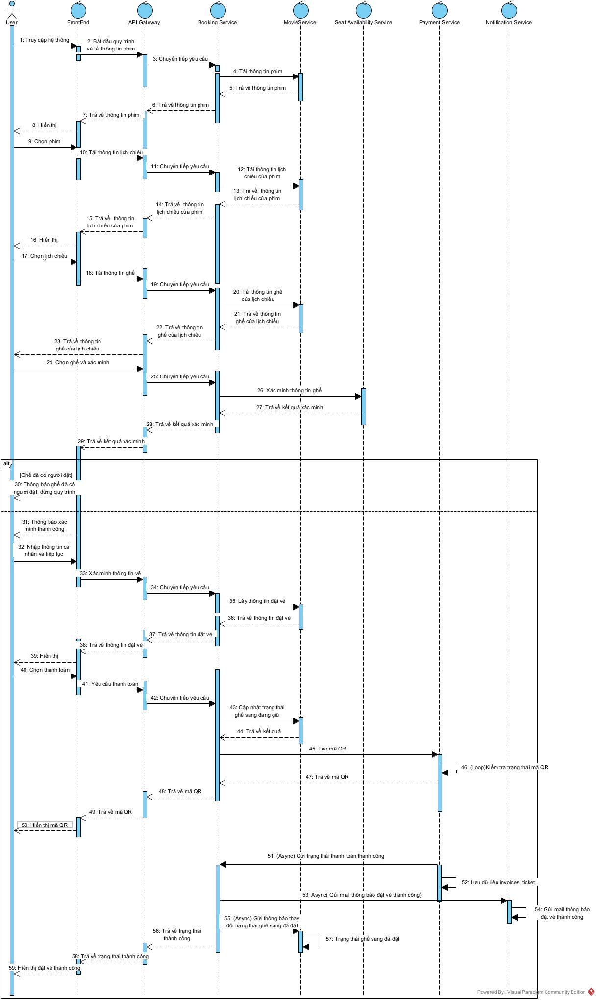

# Kiến trúc hệ thống

## Tổng quan

Mục tiêu của hệ thống là áp dụng kiến trúc vi dịch vụ vào xây dựng một module đặt vé 
xem phim giúp đảm bảo được các yêu cầu về hiệu năng, khả năng mở rộng và dễ dàng bảo trì.

Các thành phần chính và trách nhiệm tương ứng.

| Thành phâần                   | Trách nhiệm                                                                 | Công nghệ  |
|-------------------------------|-----------------------------------------------------------------------------|------------|
| **Gateway**                   | Điều hướng yêu cầu đến các service khác                                     | Springboot |
| **User Service**              | Quản lí thông tin người dùng                                                | Springboot |
| **Movie Service**             | Quản lí thông tin phim, phòng, lịch chiếu, ghế                              | Springboot |
| **Payment Service**           | Quản lí thông tin vé, hóa đơn; tạo mã QR và thông báo trạng thái thanh toán | Springboot |
| **Seat Availability Service** | Kiểm tra trạng thái sẵn sàng của ghế                                        | Springboot |
| **Notification Service**      | Gửi thông báo đặt vé thành công đến người dùng                              | Springboot |
| **Booking Service**           | Điều phối quy trình đặt vé xem phim                                         | Springboot |

---

## Các thành phần của hệ thống

### Gateway
- **Chức năng**:
  * Định tuyến yêu cầu đến các dịch vụ nội bộ.
  * Xác thực người dùng bước đầu bằng token.
- **Chức năng**:
  * Tách biệt client với các dịch vụ nội bộ
  * Kiểm soát truy cập tập trung và cung cấp lớp bảo mật

### User Service
- **Chức năng**:
    - Cung cấp thông tin người dùng dựa trên tên đăng nhập.
    - Bảo mật thông tin người dùng với mã hóa mật khẩu.
- **Vai trò**:
    - Lưu trữ và quản lý dữ liệu người dùng một cách an toàn.

### Movie Service
- **Chức năng**:
    - Lấy danh sách phim đang chiếu và sắp chiếu với thông tin chi tiết
    - Lấy lịch chiếu phim theo phòng và thời gian
    - Lấy thông tin ghế ngồi theo từng suất chiếu
    - Cập nhật trạng thái ghế khi có đặt vé hoặc hủy vé
- **Vai trò**:
    - Cung cấp API trung tâm cho tất cả thông tin liên quan đến phim và lịch chiếu
    - Đồng bộ dữ liệu với Payment Service Service thông qua Kafka

### Payment Service
- **Chức năng**:
    - Tạo mã QR code để khách hàng thực hiện thanh toán qua ví điện tử/mobile banking.
    - Kiểm tra và xác thực trạng thái thanh toán từ các cổng thanh toán bên thứ ba.
- **Chức năng**:
    - Đảm bảo tính bảo mật và đồng bộ dữ liệu thanh toán với các service khác thông qua Kafka.

### Seat Availability Service
- **Chức năng**:
    - Kiểm tra trạng thái ghế ngồi trong thời gian thực (trống/đã đặt/đang giữ chỗ)
- **Vai trò**:
    - Đảm bảo tính chính xác và nhất quán của dữ liệu ghế ngồi giữa các yêu cầu đồng thời

### Notification Service
- **Chức năng**:
    - Gửi email thông báo đến khách hàng về sự kiện thanh toán thành công.
    - Xử lý thông điệp từ Kafka liên quan đến thông tin vé và thanh toán.

- **Vai trò**:
    - Đảm bảo khách hàng nhận được thông báo kịp thời và chính xác về trạng thái thanh toán và thông tin vé.
    - Tăng cường trải nghiệm người dùng thông qua việc gửi thông báo được cá nhân hóa.

### Booking Service
- **Chức năng**:
  * Điều phối toàn bộ quy trình đặt vé.
  * Giao tiếp với các service Movie, Payment, Seat Availability, Notification
    để lấy thông tin, kiểm tra trạng thái còn trống của ghế, thanh toán và gửi
    email thông báo đến người dùng.

- **Vai trò**:
  * Là trung tâm điều phối quản lí, đảm bảo quy trình được thực hiện đúng trình tự.

### Kafka
- **Chức năng**:
    - Truyền thông tin bất đồng bộ về trạng thái thanh toán giữa các microservices.
    - Gửi sự kiện cập nhật trạng thái ghế ngồi khi có thay đổi đặt vé.
- **Vai trò**:
    - Message broker trung gian đảm bảo tính nhất quán dữ liệu giữa các service.
    - Xử lý các tác vụ nền như yêu cầu gửi email xác nhận, thông báo cho khách hàng.

---

## Cách thức giao tiếp

Các service trong hệ thống giao tiếp và phối hợp với nhau thông qua **REST APIs** và **Kafka Message Broker**
giúp tăng tính linh hoạt, khả năng mở rộng và đảm bảo hiệu suất của toàn bộ hệ thống khi phải xử lý lượng lớn
dữ liệu hoặc người dùng đồng thời.

---

## Luồng dữ liệu

### 1. Bắt đầu quy trình đặt vé 

Tải thông tin phim: 
- Gateway > Booking Service > Movie Service
- Movie Service trả dữ liệu phim về cho Booking Service
- Booking Service > Gateway > Người dùng

### 2. Chọn phim và suất chiếu
Khi chọn phim, tải thông tin lịch chiếu tương ứng với phim:  
- Gateway > Booking Service > Movie Service
- Movie Service trả dữ liệu lịch chiếu về cho Booking Service
- Booking Service > Gateway > Người dùng

Khi chọn lịch chiếu, tải thông tin ghế tương ứng với lịch chiếu:
- Gateway > Booking Service > Movie Service
- Movie Service trả dữ liệu ghế về cho Booking Service
- Booking Service > Gateway > Người dùng

### 3. Chọn ghế ngồi, xác minh ghế ngồi còn trống
Xác minh ghế: 
- Gateway > Booking Service > Seat Availability Service > Movie Service
- Movie Service trả dữ liệu ghế về cho Seat Availability Service
- Seat Availability Service trả dữ liệu ghế về cho Booking Service
- Booking Service > Gateway > Người dùng

### 4. Nếu ghế không còn trống

- Nếu ghế không còn trống thì gửi thông báo lỗi và kết thúc quy trình

### 7. Xác minh thông tin vé
Xác minh thông tin vé:
- Gateway > Booking Service > Movie Service
- Movie Service trả dữ liệu vé tổng hợp về cho Booking Service
- Booking Service > Gateway > Người dùng

### 8. Thực hiện thanh toán:
- Gateway > Booking Service > Payment Service
- Payment Service goi PayOS để tạo mã QR, lắng nghe trạng thái thanh toán và trả về cho Booking Service
- Booking Service > Gateway > Người dùng

### 9. Nếu thanh toán thành công
- Booking Service > Gateway > Người dùng
- Booking Service > Notification Service > SMTP > Người dùng 

### 10. Cập nhật tình trạng ghế ngồi
- Booking Service > Movie Service
- Movie Service lưu trạng thái ghế

### 11. Lưu thông tin vé và khách hàng vào cơ sở dữ liệu
- Booking Service > Payment Service
- Payment Service lưu vé và hóa đơn thanh toán
- Dừng quy trình

## Sơ đồ kiến trúc

**Sơ đồ kiến trúc hệ thống**

  
   
  Sơ đồ kiến trúc

**Sơ đồ tuần tự**

  
   
  Sơ đồ tuần tự

## Khả năng mở rộng và chịu lỗi

### Khả năng mở rộng:
- Kiến trúc microservices cho phép mở rộng từng dịch vụ độc lập theo nhu cầu sử dụng.
- Đăng ký dịch vụ thông qua Netflix Eureka giúp phát hiện tự động các instance mới.
- Triển khai container hóa với Docker cho phép mở rộng nhanh chóng và nhất quán.
- Giao tiếp bất đồng bộ qua Kafka giúp giảm tải và xử lý hiệu quả lượng lớn thông điệp.
- Cho phép thêm mới các dịch vụ mà không ảnh hưởng đến hệ thống hiện tại.
### Khả năng chịu lỗi:
- Cô lập lỗi với kiến trúc microservices, lỗi trong một dịch vụ không ảnh hưởng đến toàn hệ thống.
- Xử lý lỗi thống nhất thông qua GlobalExceptionHandler trong mỗi service.
- Kafka đảm bảo tin nhắn không bị mất khi có sự cố dịch vụ.
- Hệ thống tự phát hiện và phục hồi dịch vụ thông qua Eureka Service Registry.
- Cơ chế xác thực bằng JWT giúp duy trì tính khả dụng ngay cả khi Auth Service tạm thời gặp sự cố.